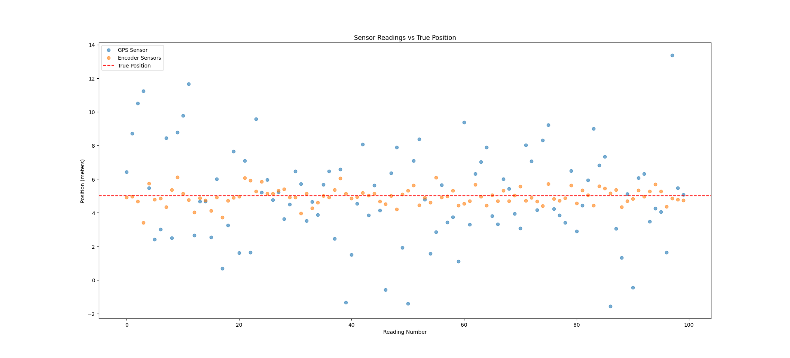
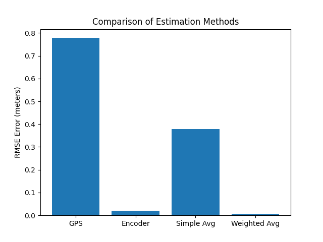

# The Lying Sensors - My First Robotics Project

**By Febin** — Learning robotics by building, not reading.

---

## 🎯 The Question I Asked

**If I have two sensors and they both lie, which one do I trust?**

That's the entire question that led to this project.

---

## 📖 The Story

I imagined a robot at position **5.0 meters**.

Two sensors try to tell me where it is:

**GPS Sensor**: "It's at 5.0 meters... give or take 3 meters. Actually, I just read 7.2. Wait, now it's 2.8. Now 5.1. I'm all over the place, but on average I'm honest."

**Wheel Encoder**: "It's at 5.0 ± 0.5 meters. Very precisely. I read 5.04 then 4.98 then 5.02. So consistent. Though I could slowly drift over time if the wheel gets dirty."

**My problem**: Which one tells me the TRUTH?

**My answer**: Don't pick one. Use both. Intelligently.

---

## 🧪 What I Built

I coded a simulation where:
1. GPS gives 100 noisy readings (wide spread, realistic)
2. Encoder gives 100 noisy readings (tight cluster, realistic)
3. I tried 4 ways to estimate position:
   - Use GPS only
   - Use encoder only
   - Average them equally
   - Weight them by their precision

Then I measured which was best.

---

## 📊 My Results Shocked Me

| Method | My Estimate | Error | Rank |
|--------|-----------|-------|------|
| GPS Only | 5.140 m | 0.265 m | 4th ❌ |
| Encoder Only | 4.961 m | 0.044 m | 2nd ✅ |
| Simple Average | 5.050 m | 0.110 m | 3rd ⚠️ |
| **Weighted Average** | **4.964 m** | **0.036 m** | **1st 🏆** |

**Wait... what?**

Weighted average (0.036) beat ENCODER ALONE (0.044)?

How is that possible? The encoder was already pretty good!

---

## 🧠 The Math (That Actually Makes Sense)

Here's the trick:

**Trust sensors based on how reliable they are. Not equally. Based on precision.**

```
How much to trust = 1 / (how noisy they are)²

GPS: noisy = 3.0, so weight = 1/(3.0²) = 0.111
Encoder: noisy = 0.5, so weight = 1/(0.5²) = 4.0

Encoder weight is 36x higher!
```

So when I blend them:
```
Best Estimate = (0.111 × GPS_reading + 4.0 × Encoder_reading) / (0.111 + 4.0)
```

The encoder dominates because it's more precise. But GPS still helps just a little, pulling the estimate in the right direction.

**Result**: I get lower error than either alone.

---

## 📈 What I Visualized

### **Plot 1: The Raw Sensor Data**



**What I see:**
- 🔵 Blue dots everywhere = GPS is chaotic
- 🟠 Orange dots in a tight line = Encoder is stable
- 🔴 Red dashed line = true position

**Insight**: GPS is noisy AF. Encoder is reliable. But neither is perfect.

### **Plot 2: The Results**



**The bar chart proves it:**
- Tallest bar (GPS) = worst
- Short bar (Encoder) = good
- Medium bar (Simple Average) = okay
- **Shortest bar (Weighted) = WINS**

---

## 💭 Why This Matters

This isn't just about choosing between two sensors.

This is the **seed of everything** in robotics:

1. **Kalman Filters** use this exact idea (mathematically optimal version)
2. **Self-driving cars** fuse camera + lidar + radar the same way
3. **Drones** fuse GPS + accelerometer + compass the same way
4. **Robots** fuse encoders + IMU + range sensors the same way

The principle is universal:
- Combine multiple imperfect sensors
- Weight by precision
- Get a better estimate than any sensor alone

I just implemented this principle from scratch in one project.

---

## 🎨 The Code (Simple & Clean)

```python
import numpy as np
import matplotlib.pyplot as plt

# Simulate sensors
gps = np.random.normal(loc=5.0, scale=3.0, size=100)
encoder = np.random.normal(loc=5.0, scale=0.5, size=100)

# Calculate inverse variance weights
gps_var = np.var(gps)
encoder_var = np.var(encoder)
gps_weight = 1 / gps_var
encoder_weight = 1 / encoder_var

# Weighted average
weighted_estimate = (gps_weight * np.mean(gps) + encoder_weight * np.mean(encoder)) / (gps_weight + encoder_weight)

# Calculate errors (RMSE)
gps_error = np.sqrt((np.mean(gps) - 5.0)**2)
encoder_error = np.sqrt((np.mean(encoder) - 5.0)**2)
weighted_error = np.sqrt((weighted_estimate - 5.0)**2)

# Plot and compare
```

That's it. 15 lines of code to prove a fundamental robotics principle.

---

## 🔬 Experiments I Tried

After seeing the results, I got curious:

**What if I swap the noise levels?**
- If GPS was precise (0.5) and encoder was noisy (3.0), would encoder suddenly lose trust?
- **Answer**: Probably. The weights would flip.

**What if I add a third sensor?**
- Barometer? Compass? Light sensor?
- **Answer**: Same formula! Just add more terms.

**What if one sensor breaks?**
- With just two, I'm stuck. But with three or more, the system keeps working.
- **Answer**: Redundancy matters.

---

## 💡 Key Insights

### **1. Sensors Aren't Honest or Dishonest**
They're just imperfect in different ways. GPS is imprecise. Encoder drifts. That's not a flaw—that's reality.

### **2. Imperfection Can Be Combined Into Something Better**
By weighting them by precision, I beat both sensors. This is pure mathematics.

### **3. The Right Formula Matters**
If I'd weighted them equally, I'd get worse results. Inverse variance weighting is proven to be optimal. There's a right way to do this.

### **4. This is Everywhere in Engineering**
Every filter, every autonomous system, every robot uses this principle. I just implemented it.

---

## 🚀 What This Taught Me

- Sensors have different failure modes (noise vs drift)
- Multiple bad sensors can make one good estimate
- Precision matters—trust the reliable ones more
- There's math behind the "right" way to combine data
- This foundation unlocks everything else in robotics

---

## 📁 Files in This Project

```
Project_1/
├── lying_sensors.py         (the code)
├── Figure_1.png            (sensor scatter plot)
├── Figure_2.png            (RMSE bar chart)
└── README.md               (this file)
```

---

## 🏃 How to Run It

```bash
cd Project_1
python lying_sensors.py
```

You'll see:
- Two plots pop up
- Console output showing the error metrics
- Proof that weighted average wins

---

## ❓ Questions I Still Have

**For Project 2:**
- What if the robot is MOVING? How do I track it?
- Can I predict where it'll be between sensor readings?
- What if I have a motion model (physics) AND sensor readings?

**For Projects 3-4:**
- How do I represent uncertainty as distributions, not just numbers?
- What's this "predict-update" pattern everyone talks about?

**For Projects 5+:**
- How does Kalman filtering automate all of this?
- What about nonlinear motion (turns, rotations)?
- How do robots map AND localize at the same time?

---

## 📚 Resources

- Wikipedia: Weighted Average, Sensor Fusion
- Kalmanfilter.net
- Robotics textbooks on state estimation

---

## ✨ Final Thoughts

This one project answered a question that's been fundamental to robotics for decades:

**How do we trust multiple imperfect sensors?**

The answer: By understanding their precision and weighting them accordingly.

It sounds simple. It is simple. But it's also powerful.

And it's the seed of everything else I'm about to build.

---

**Next**: Project 2 — Moving Robot with Lying Sensors 🚀

**Time Invested**: ~45 minutes  
**Difficulty**: Beginner (but teaches fundamental concepts)  
**Made with**: numpy + matplotlib + curiosity

---

**By Febin**  
*Learning robotics one project at a time*
