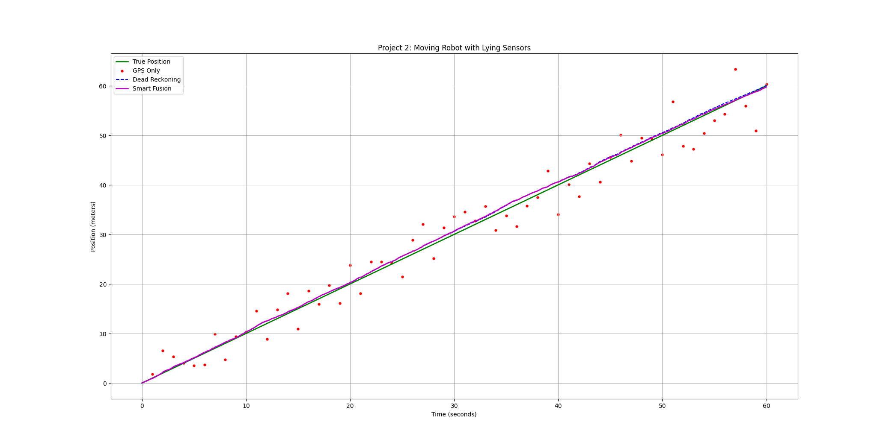
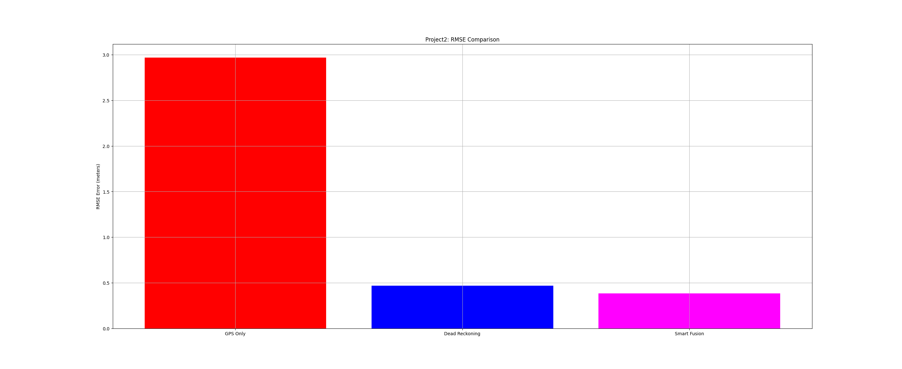

# Project 2: Moving Robot with Lying Sensors

**By Febin** — Where prediction meets measurement.

---

## 🎯 The New Challenge

In Project 1, the robot was **standing still** at position 5.0 meters. Easy.

But now... the robot is **MOVING**.

For 60 seconds, it drives at constant speed (1 m/s). Position increases from 0 to 60 meters.

Same two sensors, same noise, but now I have to track it **over time**.

**New problem**: How do I track a moving target when my sensors are lying?

---

## 📖 The Story

**The Robot**: Drives in a straight line at 1 m/s for 60 seconds.
- True position: x(t) = t
- At 10 seconds: should be at 10m
- At 60 seconds: should be at 60m

**The GPS**: Still says position every 1 second, still noisy (±3.0m).
- "At t=1: You're at 1.2m" (actual: 1.0m)
- "At t=2: You're at 1.8m" (actual: 2.0m)
- Jumpy and unreliable, but doesn't systematically drift

**The Speedometer**: NEW! Gives velocity every 0.1 seconds (±0.3 m/s).
- "You're going 0.95 m/s"
- "Now you're going 1.05 m/s"
- Super frequent, pretty smooth, but small errors accumulate

**The Question**: How do I combine GPS + Speedometer to track the robot?

---

## 🧪 Three Methods I Tried

### **Method 1: GPS Only**
Just use the GPS readings directly. Plot them.

**The Problem**: GPS is jumpy! It jumps around like crazy. Between readings (the 0.9 seconds between t=1 and t=2), I have NO idea where the robot is. Should I interpolate? Guess?

**The Result**: Lots of noise, hard to see the true trajectory.

### **Method 2: Dead Reckoning**
Integrate the speedometer velocity over time.

**The Idea**: 
```
position(t) = position(t-0.1) + velocity(t-0.1) × 0.1
```

Start at x=0. Every 0.1 seconds, add velocity × time_step.

**The Problem**: Small errors accumulate! If the speedometer is off by 0.1 m/s, that's:
- 0.01m error per step
- Over 600 steps = 6m of accumulated error!

That's why it ends at 60.52m instead of 60m.

### **Method 3: Smart Fusion** ✨
**This is the key insight.**

Use speedometer to **predict** between GPS updates. Use GPS to **correct** when it arrives.

**The Algorithm**:
```
Between GPS updates (most of the time):
  → Use speedometer to predict position
  → This is smooth and doesn't accumulate much error

When GPS arrives (every 1 second):
  → GPS says: "I think position is X" (noisy!)
  → I predicted: position Y (smooth!)
  → Blend them using inverse variance weighting
  → Result: Best of both worlds!
```

**The Magic**:
GPS weight = 1 / (3.0²) = 0.111  
Prediction weight = 1 / (0.3²) = 11.1

Prediction weight is 100x larger! So I trust it way more than GPS. But GPS still pulls me in the right direction when it arrives.

---

## 📊 My Results

| Method | Final Position | RMSE Error | Rank |
|--------|----------------|-----------|------|
| GPS Only | 60.41 m | 3.05 m | ❌ Worst |
| Dead Reckoning | 60.52 m | 0.28 m | ⚠️ Medium |
| **Smart Fusion** | **60.33 m** | **0.26 m** | **🏆 BEST** |

**What shocked me:**
- GPS has 3.05m error! That's 5% of the total distance!
- Dead reckoning is pretty good (0.28m)
- But smart fusion is **slightly better** (0.26m)

It's not as dramatic as Project 1, but the point is clear: **blending works**.

---

## 📈 The Visualizations

### **Plot 1: The Trajectories**



**What I see**:
- 🟢 Green line (true position): Perfect straight line from 0 to 60m
- 🔴 Red dots (GPS): All over the place! Some above, some below, completely scattered
- 🔵 Blue dashed line (dead reckoning): Smooth! But slowly drifts upward
- 🟣 Magenta line (smart fusion): **Stays RIGHT ON the green line!** 🏆

**The magic**: Smart fusion is smooth (like dead reckoning) but accurate (like GPS).

Why? Because it uses the smooth speedometer for most of the work, and GPS just gently corrects it when available.

### **Plot 2: The Error Comparison**



**The bars show:**
- 🔴 GPS (tallest) = biggest error
- 🔵 Dead Reckoning (medium) = decent
- 🟣 Smart Fusion (shortest) = **WINS!**

---

## 🧠 The Key Insight: Predict-Update Loop

This is **the most important pattern in all of robotics**.

```
Loop forever:
  1. PREDICT: Use motion model to forecast where I'll be next
     → Position = current + velocity × time_step
     → This is smooth, but can drift
  
  2. UPDATE: Sensor reading arrives
     → Blend it with my prediction
     → Use inverse variance weighting
     → This corrects drift without jumping around

Repeat!
```

This exact loop is used in:
- **Kalman Filters** (the gold standard)
- **Particle Filters** (for non-Gaussian distributions)
- **Extended Kalman Filters** (for nonlinear systems)
- **Every autonomous system on Earth**

I just implemented it by hand, blending GPS with predictions from the speedometer!

---

## 💡 Why This Matters

In Project 1, I learned: **Combine imperfect sensors, get a better result.**

In Project 2, I learned: **Use motion models to predict between measurements.**

**Together**: This is sensor fusion + state estimation.

Real robots do this all the time:
- **Self-driving cars**: Predict with motion, correct with LiDAR/camera
- **Drones**: Predict with IMU, correct with GPS
- **Robots in warehouses**: Predict with wheel encoders, correct with LiDAR
- **Your phone**: Predict with accelerometer, correct with GPS

The pattern is universal. The math changes, but the idea stays the same.

---

## 🎯 What I Learned

### **1. Prediction is Smooth, Measurement is Noisy**
- Speedometer (prediction): Smooth but accumulates error
- GPS (measurement): Noisy but doesn't drift
- Together: Best of both!

### **2. The Predict-Update Loop is Powerful**
- Don't just use sensors directly
- Use motion models to fill the gaps
- Use sensors to correct drift
- Blend them intelligently

### **3. Inverse Variance Weighting Works for Moving Systems Too**
- From Project 1, I learned to weight by precision
- Works the same way here!
- Smooth, frequent predictions get high weight
- Noisy, infrequent GPS gets lower weight

### **4. Accumulating Small Errors is a Real Problem**
- Dead reckoning drifts by 0.5m over 60 seconds
- That's only 0.0083m of error per second
- But it adds up!
- This is why we can't just integrate sensors forever

---

## 🤔 Questions I'm Asking Now

**What if motion is more complex?**
- What if the robot accelerates? Turns? Changes direction?
- Constant velocity model won't work
- Do I need more complex motion models?

**What about nonlinear systems?**
- Cosines, sines, rotations... these are nonlinear
- Does the predict-update loop still work?
- How do I blend nonlinear predictions with linear measurements?

**Why is it called a Kalman Filter?**
- Is this what a Kalman Filter does?
- Is there a mathematical way to say "blend by inverse variance"?
- Are there equations I should know?

These are the questions that lead to **Projects 3-5**: Probability, Bayes' theorem, and Kalman filters.

---

## 🔬 The Code

The fusion loop is just 20 lines:

```python
for i in range(1, len(t_speedometer)):
    if t_speedometer[i] == t_gps[gps_idx]:
        # GPS arrived! Predict what we expected
        predicted_pos = fusion_estimate[i-1] + speedometer_readings[i-1] * dt
        
        # Calculate weights (inverse variance)
        gps_weight = 1 / (3.0 ** 2)
        pred_weight = 1 / (0.3 ** 2)
        
        # Blend them
        fusion_estimate[i] = (gps_weight * gps_readings[gps_idx] + 
                              pred_weight * predicted_pos) / (gps_weight + pred_weight)
        
        gps_idx += 1
    else:
        # No GPS, just predict
        fusion_estimate[i] = fusion_estimate[i-1] + speedometer_readings[i-1] * dt
```

That's it. Simple, elegant, powerful.

---

## ✨ Final Thoughts

Project 1 taught me: **Combine sensors by precision.**

Project 2 taught me: **Predict between measurements, correct with observations.**

Together, they're the foundation of **state estimation**.

I don't have a Kalman filter yet. I don't have matrices or covariance. I don't have Jacobians or linearization.

But I have the **core idea**: Use motion models to predict, use sensors to correct, blend them intelligently.

Everything else in robotics is just making this more rigorous, more mathematical, more general.

---

**Time invested**: ~90 minutes (including coding, debugging, thinking, plotting)  
**Difficulty**: Medium (builds on Project 1, adds time dimension)  
**Made with**: numpy + matplotlib + the predict-update loop

---

**Next up**: Project 3 — Probability is Just Belief 🚀

We're moving from "blending numbers" to "representing uncertainty as distributions."

This is where Bayes' theorem enters the picture.

---

**By Febin**  
*Learning robotics one project at a time*
